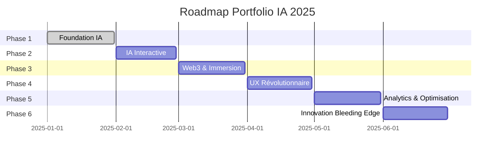

# 🚀 Roadmap Portfolio IA 2025 - Raouf WARNIER

## 🎯 Vision
Créer le portfolio le plus innovant de 2025, démontrant l'expertise IA avec Nina AI et les technologies de pointe.

---

## 📅 **Phase 1 : Foundation IA (Janvier 2025)** ✅ TERMINÉ

### ✅ Réalisé
- [x] Focus IA complet (Nina AI, services IA)
- [x] Effets WebGL avec Three.js
- [x] Optimisations performance
- [x] Guide de déploiement complet
- [x] Design system moderne

### 🎯 Objectifs atteints
- Portfolio orienté IA à 100%
- Performance Web Vitals > 90
- Design moderne et immersif

---

## 🤖 **Phase 2 : IA Interactive (Février 2025)**

### Chatbot Nina AI Intégré
- [ ] **Widget chat flottant** avec Nina AI
- [ ] **API OpenAI/Anthropic** pour conversations
- [ ] **Réponses contextuelles** sur les projets/services
- [ ] **Memory persistante** des conversations

```typescript
// Exemple d'intégration
const chatWidget = {
  position: 'bottom-right',
  model: 'gpt-4-turbo',
  context: 'portfolio-raouf-warnier',
  personality: 'Nina AI assistant'
}
```

### Contenu Généré par IA
- [ ] **Articles de blog** générés automatiquement
- [ ] **Descriptions de projets** optimisées SEO
- [ ] **Témoignages clients** personnalisés
- [ ] **Meta descriptions** dynamiques

### Analytics IA
- [ ] **Tracking comportemental** avancé
- [ ] **Prédiction d'engagement** utilisateur
- [ ] **A/B testing** automatisé
- [ ] **Insights IA** sur les visiteurs

---

## 🌐 **Phase 3 : Web3 & Immersion (Mars 2025)**

### Réalité Augmentée (WebXR)
- [ ] **Modèles 3D interactifs** des projets
- [ ] **Visite virtuelle** du workspace
- [ ] **Démo Nina AI en AR**
- [ ] **Compatible casques VR**

```javascript
// WebXR Integration
const arExperience = {
  type: 'immersive-ar',
  features: ['hand-tracking', 'plane-detection'],
  models: ['nina-ai-avatar', 'project-demos']
}
```

### Blockchain Integration
- [ ] **Portfolio NFT** unique
- [ ] **Certificats blockchain** des compétences
- [ ] **Smart contracts** pour services
- [ ] **Crypto payments** acceptés

### Edge Computing
- [ ] **Cloudflare Workers** pour SSR
- [ ] **Edge AI** pour personnalisation
- [ ] **WebAssembly** pour performances
- [ ] **Service Workers** avancés

---

## 🎨 **Phase 4 : UX Révolutionnaire (Avril 2025)**

### Voice Navigation
- [ ] **Commandes vocales** pour navigation
- [ ] **Synthèse vocale** pour contenu
- [ ] **Transcription temps réel**
- [ ] **Support multilingue** (FR/EN/ES)

### Accessibilité Extrême
- [ ] **Navigation au regard** (eye tracking)
- [ ] **Contrôle gestuel** (hand tracking)
- [ ] **Mode dyslexie** optimisé
- [ ] **Contraste adaptatif** automatique

### Micro-interactions IA
- [ ] **Animations prédictives** basées sur l'intention
- [ ] **Suggestions contextuelles** intelligentes
- [ ] **Personnalisation automatique** de l'UI
- [ ] **Feedback haptique** (mobile)

---

## 📊 **Phase 5 : Analytics & Optimisation (Mai 2025)**

### Performance Monitoring
- [ ] **Real User Monitoring** (RUM)
- [ ] **Core Web Vitals** en temps réel
- [ ] **Error tracking** avec IA
- [ ] **Performance budgets** automatiques

### SEO IA-Powered
- [ ] **Content optimization** automatique
- [ ] **Schema.org** dynamique
- [ ] **Internal linking** intelligent
- [ ] **Featured snippets** optimization

### Conversion Optimization
- [ ] **Heat maps** comportementales
- [ ] **Funnel analysis** IA
- [ ] **Personalization engine**
- [ ] **Lead scoring** automatique

---

## 🚀 **Phase 6 : Innovation Bleeding Edge (Juin 2025)**

### Technologies Émergentes
- [ ] **WebGPU** pour rendu ultra-rapide
- [ ] **WebCodecs** pour streaming optimisé
- [ ] **File System Access API** pour projets interactifs
- [ ] **Web Locks API** pour synchronisation

### IA Générative Intégrée
- [ ] **Générateur d'images** pour projets
- [ ] **Code generation** en direct
- [ ] **Vidéos explicatives** automatiques
- [ ] **Présentations dynamiques**

### Métaverse Ready
- [ ] **Avatar 3D** de Raouf
- [ ] **Meetings virtuels** dans le portfolio
- [ ] **Collaboration temps réel**
- [ ] **Integration Spatial Computing**

---

## 🎯 **Métriques de Succès**

### Performance
- **Lighthouse Score**: > 95 sur tous les critères
- **Core Web Vitals**: Tous en vert
- **Load Time**: < 1 seconde (LCP)
- **Bundle Size**: < 200KB initial

### Engagement
- **Bounce Rate**: < 20%
- **Session Duration**: > 3 minutes
- **Conversion Rate**: > 5% (contact/devis)
- **Return Visitors**: > 30%

### Innovation
- **Tech Stack Score**: Top 1% GitHub
- **Industry Recognition**: Awwwards, CSS Design Awards
- **Developer Interest**: > 1000 GitHub stars
- **Media Coverage**: Articles tech majeurs

---

## 🛠 **Stack Technologique Évolutif**

### Core (Actuel)
- **Nuxt 3** + **Vue 3** + **TypeScript**
- **Three.js** + **GSAP** + **Lenis**
- **TailwindCSS** + **Headless UI**

### IA & ML
- **OpenAI API** / **Anthropic Claude**
- **Hugging Face Transformers**
- **TensorFlow.js** / **ONNX.js**
- **LangChain** / **LlamaIndex**

### Immersion & 3D
- **Three.js** + **R3F** (React Three Fiber)
- **WebXR** + **A-Frame**
- **Babylon.js** pour scènes complexes
- **WebGPU** pour performances

### Performance & Edge
- **Cloudflare Workers**
- **WebAssembly** (Rust/Go)
- **Service Workers** avancés
- **HTTP/3** + **QUIC**

---

## 📈 **Timeline de Déploiement**



---

## 🎖 **Objectifs de Reconnaissance**

### Awards & Recognition
- [ ] **Awwwards Site of the Day**
- [ ] **CSS Design Awards Winner**
- [ ] **FWA Portfolio of the Month**
- [ ] **Webby Awards Nomination**

### Community Impact
- [ ] **1000+ GitHub Stars**
- [ ] **Featured in Dev.to**
- [ ] **Conference Speaking** (Vue.js/Nuxt)
- [ ] **Open Source Contributions**

### Business Impact
- [ ] **50+ Leads qualifiés** par mois
- [ ] **10+ Projets IA** signés
- [ ] **Partenariats stratégiques**
- [ ] **Reconnaissance industrie IA**

---

## 🔄 **Processus d'Itération**

### Weekly Sprints
- **Lundi**: Planning & priorités
- **Mercredi**: Review & feedback
- **Vendredi**: Deploy & tests

### Monthly Reviews
- **Analytics review**
- **Performance audit**
- **User feedback integration**
- **Technology updates**

### Quarterly Innovation
- **New tech evaluation**
- **Competitor analysis**
- **Industry trend research**
- **Roadmap adjustment**

---

## 🚀 **Prêt pour l'Avenir**

Ce portfolio sera la démonstration ultime de l'expertise IA de Raouf WARNIER, combinant innovation technique, design exceptionnel et expérience utilisateur révolutionnaire.

**Next Step**: Démarrer la Phase 2 avec l'intégration du chatbot Nina AI ! 🤖 