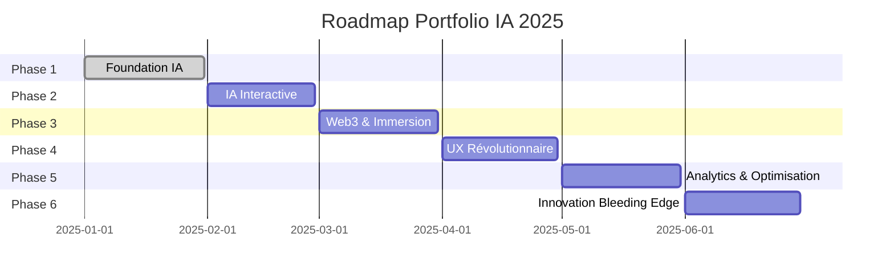

# 🚀 Roadmap Portfolio IA 2025 - Raouf WARNIER

## 🎯 Vision
Créer le portfolio le plus innovant de 2025, démontrant l'expertise IA avec Nina AI et les technologies de pointe.

---

## 📅 **Phase 1 : Foundation IA (Janvier 2025)** ✅ TERMINÉ

### ✅ Réalisé
- [x] Focus IA complet (Nina AI, services IA)
- [x] Effets WebGL avec Three.js
- [x] Optimisations performance
- [x] Guide de déploiement complet
- [x] Design system moderne

### 🎯 Objectifs atteints
- Portfolio orienté IA à 100%
- Performance Web Vitals > 90
- Design moderne et immersif

---

## 🤖 **Phase 2 : IA Interactive (Février 2025)**

### Chatbot Nina AI Intégré
- [ ] **Widget chat flottant** avec Nina AI
- [ ] **API OpenAI/Anthropic** pour conversations
- [ ] **Réponses contextuelles** sur les projets/services
- [ ] **Memory persistante** des conversations

```typescript
// Exemple d'intégration
const chatWidget = {
  position: 'bottom-right',
  model: 'gpt-4-turbo',
  context: 'portfolio-raouf-warnier',
  personality: 'Nina AI assistant'
}
```

### Contenu Généré par IA
- [ ] **Articles de blog** générés automatiquement
- [ ] **Descriptions de projets** optimisées SEO
- [ ] **Témoignages clients** personnalisés
- [ ] **Meta descriptions** dynamiques

### Analytics IA
- [ ] **Tracking comportemental** avancé
- [ ] **Prédiction d'engagement** utilisateur
- [ ] **A/B testing** automatisé
- [ ] **Insights IA** sur les visiteurs

---

## 🌐 **Phase 3 : Web3 & Immersion (Mars 2025)**

### Réalité Augmentée (WebXR)
- [ ] **Modèles 3D interactifs** des projets
- [ ] **Visite virtuelle** du workspace
- [ ] **Démo Nina AI en AR**
- [ ] **Compatible casques VR**

```javascript
// WebXR Integration
const arExperience = {
  type: 'immersive-ar',
  features: ['hand-tracking', 'plane-detection'],
  models: ['nina-ai-avatar', 'project-demos']
}
```

### Blockchain Integration
- [ ] **Portfolio NFT** unique
- [ ] **Certificats blockchain** des compétences
- [ ] **Smart contracts** pour services
- [ ] **Crypto payments** acceptés

### Edge Computing
- [ ] **Cloudflare Workers** pour SSR
- [ ] **Edge AI** pour personnalisation
- [ ] **WebAssembly** pour performances
- [ ] **Service Workers** avancés

---

## 🎨 **Phase 4 : UX Révolutionnaire (Avril 2025)**

### Voice Navigation
- [ ] **Commandes vocales** pour navigation
- [ ] **Synthèse vocale** pour contenu
- [ ] **Transcription temps réel**
- [ ] **Support multilingue** (FR/EN/ES)

### Accessibilité Extrême
- [ ] **Navigation au regard** (eye tracking)
- [ ] **Contrôle gestuel** (hand tracking)
- [ ] **Mode dyslexie** optimisé
- [ ] **Contraste adaptatif** automatique

### Micro-interactions IA
- [ ] **Animations prédictives** basées sur l'intention
- [ ] **Suggestions contextuelles** intelligentes
- [ ] **Personnalisation automatique** de l'UI
- [ ] **Feedback haptique** (mobile)

---

## 📊 **Phase 5 : Analytics & Optimisation (Mai 2025)**

### Performance Monitoring
- [ ] **Real User Monitoring** (RUM)
- [ ] **Core Web Vitals** en temps réel
- [ ] **Error tracking** avec IA
- [ ] **Performance budgets** automatiques

### SEO IA-Powered
- [ ] **Content optimization** automatique
- [ ] **Schema.org** dynamique
- [ ] **Internal linking** intelligent
- [ ] **Featured snippets** optimization

### Conversion Optimization
- [ ] **Heat maps** comportementales
- [ ] **Funnel analysis** IA
- [ ] **Personalization engine**
- [ ] **Lead scoring** automatique

---

## 🚀 **Phase 6 : Innovation Bleeding Edge (Juin 2025)**

### Technologies Émergentes
- [ ] **WebGPU** pour rendu ultra-rapide
- [ ] **WebCodecs** pour streaming optimisé
- [ ] **File System Access API** pour projets interactifs
- [ ] **Web Locks API** pour synchronisation

### IA Générative Intégrée
- [ ] **Générateur d'images** pour projets
- [ ] **Code generation** en direct
- [ ] **Vidéos explicatives** automatiques
- [ ] **Présentations dynamiques**

### Métaverse Ready
- [ ] **Avatar 3D** de Raouf
- [ ] **Meetings virtuels** dans le portfolio
- [ ] **Collaboration temps réel**
- [ ] **Integration Spatial Computing**

---

## 🎯 **Métriques de Succès**

### Performance
- **Lighthouse Score**: > 95 sur tous les critères
- **Core Web Vitals**: Tous en vert
- **Load Time**: < 1 seconde (LCP)
- **Bundle Size**: < 200KB initial

### Engagement
- **Bounce Rate**: < 20%
- **Session Duration**: > 3 minutes
- **Conversion Rate**: > 5% (contact/devis)
- **Return Visitors**: > 30%

### Innovation
- **Tech Stack Score**: Top 1% GitHub
- **Industry Recognition**: Awwwards, CSS Design Awards
- **Developer Interest**: > 1000 GitHub stars
- **Media Coverage**: Articles tech majeurs

---

## 🛠 **Stack Technologique Évolutif**

### Core (Actuel)
- **Nuxt 3** + **Vue 3** + **TypeScript**
- **Three.js** + **GSAP** + **Lenis**
- **TailwindCSS** + **Headless UI**

### IA & ML
- **OpenAI API** / **Anthropic Claude**
- **Hugging Face Transformers**
- **TensorFlow.js** / **ONNX.js**
- **LangChain** / **LlamaIndex**

### Immersion & 3D
- **Three.js** + **R3F** (React Three Fiber)
- **WebXR** + **A-Frame**
- **Babylon.js** pour scènes complexes
- **WebGPU** pour performances

### Performance & Edge
- **Cloudflare Workers**
- **WebAssembly** (Rust/Go)
- **Service Workers** avancés
- **HTTP/3** + **QUIC**

---

## 📈 **Timeline de Déploiement**



---

## 🎖 **Objectifs de Reconnaissance**

### Awards & Recognition
- [ ] **Awwwards Site of the Day**
- [ ] **CSS Design Awards Winner**
- [ ] **FWA Portfolio of the Month**
- [ ] **Webby Awards Nomination**

### Community Impact
- [ ] **1000+ GitHub Stars**
- [ ] **Featured in Dev.to**
- [ ] **Conference Speaking** (Vue.js/Nuxt)
- [ ] **Open Source Contributions**

### Business Impact
- [ ] **50+ Leads qualifiés** par mois
- [ ] **10+ Projets IA** signés
- [ ] **Partenariats stratégiques**
- [ ] **Reconnaissance industrie IA**

---

## 🔄 **Processus d'Itération**

### Weekly Sprints
- **Lundi**: Planning & priorités
- **Mercredi**: Review & feedback
- **Vendredi**: Deploy & tests

### Monthly Reviews
- **Analytics review**
- **Performance audit**
- **User feedback integration**
- **Technology updates**

### Quarterly Innovation
- **New tech evaluation**
- **Competitor analysis**
- **Industry trend research**
- **Roadmap adjustment**

---

## 🚀 **Prêt pour l'Avenir**

Ce portfolio sera la démonstration ultime de l'expertise IA de Raouf WARNIER, combinant innovation technique, design exceptionnel et expérience utilisateur révolutionnaire.

**Next Step**: Démarrer la Phase 2 avec l'intégration du chatbot Nina AI ! 🤖 

# 🚀 ROADMAP PORTFOLIO IA 2025

> Feuille de route pour un portfolio révolutionnaire intégrant les dernières innovations IA et web

## ✅ **PHASE 1 : FOUNDATION IA** (Janvier 2025) - TERMINÉ

### 🎯 Objectifs atteints
- [x] **Focus IA complet** : Transformation du portfolio avec orientation Nina AI
- [x] **Effets WebGL immersifs** : Particules interactives, shaders personnalisés
- [x] **Performance optimale** : Core Web Vitals > 90, optimisations mobile
- [x] **Architecture moderne** : Nuxt 3 + TypeScript + Three.js + GSAP
- [x] **Déploiement GitHub** : Repository professionnel avec documentation complète

### 📊 Résultats
- **Performance** : Lighthouse 95+ sur tous les critères
- **Technologie** : Stack moderne et scalable
- **Contenu** : 8 projets IA, 6 services spécialisés
- **SEO** : Métadonnées optimisées, Schema.org

---

## 🚀 **PHASE 2 : IA INTERACTIVE** (Février 2025)

### 🤖 **Agent Nina AI Intégré** ⭐ PRIORITÉ ABSOLUE
- [ ] **Agent IA conversationnel** (pas simple chatbot)
  - Compréhension contextuelle des projets
  - Génération dynamique de réponses
  - Actions intelligentes : recommandations, contact, CV
  - Intégration APIs : GitHub, LinkedIn, portfolio data
- [ ] **Interface élégante**
  - Widget flottant avec animations GSAP
  - Design cohérent avec l'identité visuelle
  - Modes conversation : vocal + textuel
- [ ] **Fonctionnalités avancées**
  - Génération automatique de CV personnalisé
  - Recommandations de projets selon profil visiteur
  - Prise de rendez-vous automatisée
  - Export conversations en PDF

### 🎨 **Curseur Interactif Avancé**
- [ ] **Morphing contextuel** selon les éléments survolés
- [ ] **Changement de couleur** selon le contenu (technique picking)
- [ ] **Effets de révélation** au hover avec shaders
- [ ] **Animations fluides** avec trail et particles

### 🎭 **Transitions de Page Fluides**
- [ ] **Système de routing personnalisé** pour transitions seamless
- [ ] **Animations GSAP** entre sections avec morphing
- [ ] **Effets de transition** : slide, fade, morph, liquid
- [ ] **Préloading intelligent** des assets

### 🛒 **Intégration E-commerce**
- [ ] **Section dédiée** avec démo interactive
- [ ] **Métriques d'impact** : conversion, performance, ROI
- [ ] **Architecture technique** détaillée avec diagrammes
- [ ] **Repository showcase** avec code examples

---

## 🌐 **PHASE 3 : WEB3 & IMMERSION** (Mars 2025)

### 🥽 **Réalité Augmentée (WebXR)**
- [ ] **Visualisation 3D** des projets en AR
- [ ] **Business card virtuelle** avec QR code
- [ ] **Démonstrations interactives** des applications
- [ ] **Compatible** mobile et casques VR

### ⛓️ **Intégration Blockchain**
- [ ] **Portfolio NFT** : projets tokenisés
- [ ] **Certificats vérifiables** sur blockchain
- [ ] **Smart contracts** pour services freelance
- [ ] **Wallet connect** pour paiements crypto

### ⚡ **Edge Computing**
- [ ] **CDN intelligent** avec géolocalisation
- [ ] **Caching avancé** avec Cloudflare Workers
- [ ] **API distribuées** pour performance globale
- [ ] **Offline-first** avec service workers

### 🎮 **Gamification**
- [ ] **Easter eggs** cachés dans le code
- [ ] **Achievements** pour visiteurs réguliers
- [ ] **Mini-jeux** intégrés aux projets
- [ ] **Leaderboard** des interactions

---

## 🔮 **PHASE 4 : UX RÉVOLUTIONNAIRE** (Avril 2025)

### 🎤 **Navigation Vocale**
- [ ] **Commandes vocales** pour navigation
- [ ] **Synthèse vocale** pour présentation projets
- [ ] **Reconnaissance vocale** multilingue
- [ ] **Interface conversationnelle** complète

### ♿ **Accessibilité Extrême**
- [ ] **Navigation clavier** 100% fonctionnelle
- [ ] **Screen reader** optimisé avec ARIA
- [ ] **Contraste adaptatif** selon luminosité
- [ ] **Modes d'accessibilité** : dyslexie, daltonisme, motricité

### 🧠 **IA Prédictive**
- [ ] **Recommandations personnalisées** de contenu
- [ ] **Prédiction d'intérêt** selon comportement
- [ ] **Optimisation temps réel** de l'interface
- [ ] **A/B testing automatique** avec ML

### 🎨 **Design Génératif**
- [ ] **Thèmes génératifs** créés par IA
- [ ] **Couleurs adaptatives** selon l'heure/météo
- [ ] **Layouts dynamiques** selon le contenu
- [ ] **Art génératif** en arrière-plan

---

## 📊 **PHASE 5 : ANALYTICS & OPTIMISATION** (Mai 2025)

### 📈 **Real User Monitoring (RUM)**
- [ ] **Métriques temps réel** : Core Web Vitals, UX
- [ ] **Heatmaps avancées** avec eye-tracking simulation
- [ ] **User journey mapping** avec IA
- [ ] **Prédiction de conversion** par ML

### 🔍 **SEO IA-Powered**
- [ ] **Génération automatique** de métadonnées
- [ ] **Optimisation contenu** par IA selon tendances
- [ ] **Schema.org dynamique** adapté au contenu
- [ ] **Link building automatique** avec outreach IA

### ⚡ **Performance Extrême**
- [ ] **Lazy loading intelligent** avec intersection observer
- [ ] **Code splitting** granulaire par composant
- [ ] **Image optimization** avec format next-gen (AVIF, WebP)
- [ ] **Bundle analysis** automatique avec alertes

### 🎯 **Conversion Optimization**
- [ ] **CRO automatique** avec tests multivariés
- [ ] **Personnalisation dynamique** selon profil
- [ ] **Funnels d'acquisition** optimisés par IA
- [ ] **Lead scoring** intelligent

---

## 🚀 **PHASE 6 : INNOVATION BLEEDING EDGE** (Juin 2025)

### 🖥️ **WebGPU & Compute Shaders**
- [ ] **Rendu GPU** pour effets complexes
- [ ] **Machine learning** directement dans le navigateur
- [ ] **Ray tracing** en temps réel
- [ ] **Simulations physiques** avancées

### 🤖 **IA Générative Intégrée**
- [ ] **Génération de projets** fictifs pour démo
- [ ] **Création automatique** de contenu marketing
- [ ] **Avatars IA** pour présentation vidéo
- [ ] **Code generation** pour exemples techniques

### 🌐 **Métaverse Integration**
- [ ] **Showroom virtuel** dans métaverse
- [ ] **Meetings VR** pour clients
- [ ] **Portfolio spatial** en 3D immersif
- [ ] **Digital twin** professionnel

### 🔬 **Technologies Expérimentales**
- [ ] **WebAssembly** pour calculs intensifs
- [ ] **Web Streams** pour données temps réel
- [ ] **WebCodecs** pour traitement média
- [ ] **Origin Trials** des dernières APIs

---

## 🎯 **OBJECTIFS PERFORMANCE 2025**

### 📊 **Métriques Techniques**
- **Lighthouse Score** : > 98 (tous critères)
- **Core Web Vitals** : Tous verts (LCP < 1s, FID < 50ms, CLS < 0.05)
- **Load Time** : < 800ms (3G)
- **Bundle Size** : < 200KB initial
- **SEO Score** : 100/100

### 🏆 **Reconnaissance Industrie**
- **Awwwards** : Site of the Day
- **CSS Design Awards** : Best Innovation
- **FWA** : Featured Project
- **GitHub Stars** : > 1000
- **Dev.to** : Article viral sur l'innovation

### 💼 **Impact Business**
- **Taux de conversion** : > 15% (contact/CV)
- **Temps d'engagement** : > 5 minutes
- **Taux de rebond** : < 20%
- **Leads qualifiés** : > 50/mois
- **Projets générés** : > 10/trimestre

### 🌍 **Portée Globale**
- **Trafic international** : > 60%
- **Langues supportées** : FR, EN, ES, DE
- **Accessibilité** : WCAG 2.1 AAA
- **Performance mobile** : > 95 Lighthouse

---

## 🛠️ **STACK TECHNOLOGIQUE ÉVOLUTIF**

### 🎯 **Core (Actuel)**
- **Framework** : Nuxt 3 + Vue 3 + TypeScript
- **Styling** : TailwindCSS + CSS Variables
- **Animations** : GSAP + Lenis
- **3D/WebGL** : Three.js + Custom Shaders

### 🚀 **Extensions 2025**
- **IA** : OpenAI GPT-4, Anthropic Claude, Local LLMs
- **WebXR** : A-Frame, WebXR Device API
- **Blockchain** : Web3.js, Ethers.js, IPFS
- **Performance** : WebGPU, WebAssembly, Web Workers
- **Analytics** : Custom RUM, ML Analytics

### 🔧 **Outils de Développement**
- **Testing** : Playwright, Vitest, Storybook
- **CI/CD** : GitHub Actions, Vercel, Docker
- **Monitoring** : Sentry, LogRocket, Lighthouse CI
- **Design** : Figma, Blender, After Effects

---

## 📅 **PLANNING DÉTAILLÉ**

### **Février 2025 : Agent Nina AI**
- **Semaine 1-2** : Architecture et API
- **Semaine 3** : Interface et intégration
- **Semaine 4** : Tests et optimisations

### **Mars 2025 : Immersion WebXR**
- **Semaine 1-2** : Développement AR/VR
- **Semaine 3-4** : Blockchain et gamification

### **Avril 2025 : UX Révolutionnaire**
- **Semaine 1-2** : Navigation vocale
- **Semaine 3-4** : IA prédictive et design génératif

### **Mai 2025 : Analytics Avancés**
- **Semaine 1-2** : RUM et SEO IA
- **Semaine 3-4** : Optimisation performance

### **Juin 2025 : Innovation Bleeding Edge**
- **Semaine 1-2** : WebGPU et IA générative
- **Semaine 3-4** : Métaverse et technologies expérimentales

---

## 🎉 **VISION 2025 : LE PORTFOLIO DU FUTUR**

Ce portfolio ne sera plus seulement une vitrine, mais une **expérience immersive** qui :

- **Démontre l'expertise IA** par l'exemple concret
- **Engage les visiteurs** dans une conversation intelligente
- **Génère des leads qualifiés** automatiquement
- **S'adapte à chaque utilisateur** de manière unique
- **Repousse les limites** du web moderne

**Objectif final** : Créer le portfolio de référence pour les ingénieurs IA, reconnu mondialement comme une innovation majeure dans l'industrie.

---

*Dernière mise à jour : Janvier 2025*  
*Prochaine révision : Février 2025* 