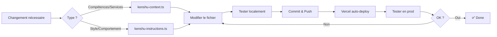

# 🤖 Kenshu AI - Configuration des Prompts

## 📁 Structure

Ce dossier contient toute la configuration centralisée de l'IA Kenshu, séparée en fichiers modulaires pour faciliter la maintenance.

```
src/lib/ai-prompts/
├── README.md                    # Ce fichier - Guide de maintenance
├── kenshu-context.ts           # Contexte : Services, compétences, limites
└── kenshu-instructions.ts      # Instructions : Style, comportement, personas
```

## 📝 Fichiers

### `kenshu-context.ts`
**Quoi** : Informations factuelles sur Raouf Warnier et ses services

**Contient** :
- ✅ Philosophie Kenshu (signification, pourquoi certains services sont en mode Kenshu)
- ✅ Catalogue de services avec niveaux de complexité (Simple/Moyen/Avancé)
- ✅ Compétences réelles (Expert / Avancé / En apprentissage / Non proposé)
- ✅ Limites importantes et ce que Raouf ne fait PAS
- ✅ Projets SaaS en production (Budget AI, AI Compliance)
- ✅ Expériences professionnelles (BNP, Orange, Safran, ACC)

**Quand mettre à jour** :
- ✏️ Nouveau service ou compétence
- ✏️ Changement de niveau de complexité d'un projet type
- ✏️ Nouveau projet SaaS lancé
- ✏️ Nouvelle expérience professionnelle

### `kenshu-instructions.ts`
**Quoi** : Comment l'IA doit se comporter et communiquer

**Contient** :
- ✅ Règles de présentation (concision, éviter les pavés de texte)
- ✅ Style et formatage (espacement, emojis, boutons)
- ✅ Adaptabilité selon le profil utilisateur (PME vs Grand Groupe)
- ✅ Promotion subtile des produits SaaS
- ✅ Contrôle d'interface (confettis, feux d'artifice)
- ✅ Personas thématiques (Matrix, Cyberpunk, Retro, Zen)
- ✅ Tarification

**Quand mettre à jour** :
- ✏️ Amélioration du style de communication
- ✏️ Nouveau thème visuel ajouté au site
- ✏️ Ajout de nouvelles actions UI
- ✏️ Changement de tarifs

## 🎯 Pourquoi cette séparation ?

### ✅ **Avantages**

1. **Maintenabilité** 📦
   - Chaque fichier a une responsabilité claire
   - Plus facile de trouver et mettre à jour une info spécifique

2. **Réutilisabilité** ♻️
   - Le contexte peut être exposé ailleurs (page /about, /services)
   - Les instructions peuvent évoluer sans toucher aux données

3. **Versionning** 📝
   - Plus facile de voir ce qui change dans Git
   - Comparaison de prompts entre versions

4. **Collaboration** 👥
   - Une personne peut mettre à jour les services
   - Une autre peut optimiser le style de communication
   - Pas de conflits Git

## 🔧 Comment mettre à jour

### Ajouter un nouveau service

1. Ouvrir `kenshu-context.ts`
2. Ajouter une entrée dans `SERVICES_CATALOG`
3. Définir `kenshuMode` selon si c'est un domaine en R&D
4. Si `kenshuMode: true`, expliquer pourquoi dans `whyKenshu`
5. Lister les projets avec leur niveau de complexité

```typescript
"Nouveau Service": {
  description: "Description courte",
  kenshuMode: false, // ou true si en exploration
  whyKenshu: "Optionnel - explication si kenshuMode = true",
  projects: [
    {
      title: "Projet Type",
      complexity: "Moyen",
      skills: ["Tech1", "Tech2"],
      description: "Description du projet",
    },
  ],
},
```

### Ajuster le comportement de l'IA

1. Ouvrir `kenshu-instructions.ts`
2. Modifier `AI_BEHAVIOR_INSTRUCTIONS` pour le comportement général
3. Modifier `THEME_PERSONAS` pour un thème spécifique

### Ajouter une nouvelle compétence

1. Ouvrir `kenshu-context.ts`
2. Ajouter dans la catégorie appropriée de `REAL_SKILLS` :
   - `expert` : 5+ ans d'expérience
   - `advanced` : 2-5 ans, niveau confirmé
   - `learning` : En cours d'apprentissage actif

## ⚠️ Règles importantes

### ❌ À NE PAS FAIRE

1. **Ne JAMAIS mentir sur les compétences**
   - Si Raouf ne sait pas faire → `notOffered`
   - Si c'est en apprentissage → `learning`, pas `expert`

2. **Ne PAS donner d'estimations de temps**
   - Utiliser les niveaux de complexité à la place
   - Les délais varient trop selon la charge

3. **Ne PAS dupliquer les informations**
   - Si ça existe dans le code → ne pas répéter dans le prompt
   - Si c'est important → le centraliser ici

### ✅ BEST PRACTICES

1. **Être transparent sur les limites**
   - C'est BIEN de dire "Je ne fais pas X, je peux vous recommander Y"
   - Mieux vaut rediriger que décevoir

2. **Maintenir à jour régulièrement**
   - Après chaque nouveau projet significatif
   - Après chaque montée en compétence
   - Au moins 1x/mois faire un audit

3. **Tester après chaque modification**
   - Ouvrir le chat Kenshu
   - Poser des questions sur ce qui a changé
   - Vérifier que l'IA répond correctement

## 📊 Niveaux de Complexité

### Comment attribuer un niveau ?

- **Simple** 🟢
  - 1-5 jours de travail
  - Technologies bien maîtrisées
  - Scope clair et limité
  - Exemples : Landing Page, Audit Infra, Workflow simple

- **Moyen** 🟡
  - 1-4 semaines
  - Nécessite plusieurs compétences
  - Intégrations multiples
  - Exemples : Site Vitrine CMS, Pipeline ETL, RAG

- **Avancé** 🔴
  - 1-6 mois
  - Architectures complexes
  - Scalabilité critique
  - Exemples : E-commerce, Migration Cloud, Agents Autonomes

## 🔄 Processus de mise à jour



## 📞 Contact

Si tu modifies ces prompts et que l'IA dit des bêtises, c'est probablement une erreur de configuration.

**Checklist debug** :
- [ ] Les informations sont-elles à jour ?
- [ ] Y a-t-il des contradictions dans le prompt ?
- [ ] L'IA a-t-elle assez de contexte pour répondre ?
- [ ] Les limites sont-elles clairement définies ?

---

**Dernière mise à jour** : 2026-01-20
**Maintenu par** : Raouf Warnier (contact@kenshu.dev)
